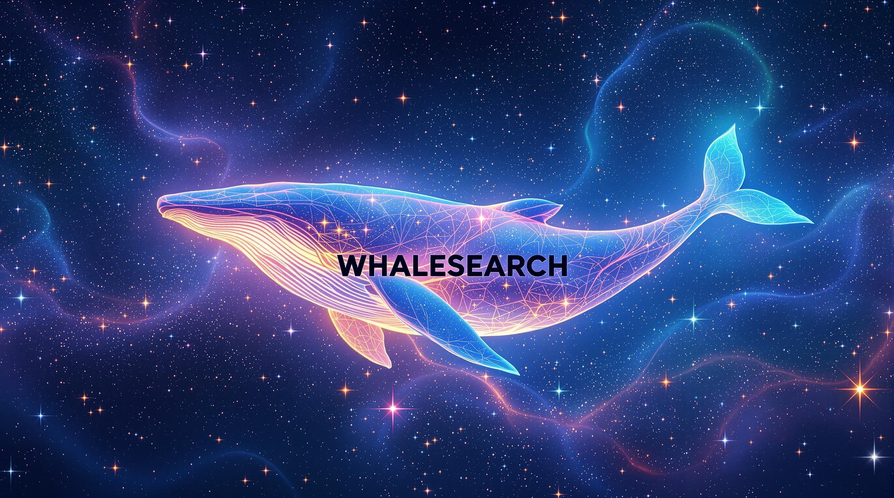

> [!NOTE]
>
> ... i wanted to explore the rag stuff, so this is the simplest implmentation of rag.
>
> ... it is my attempt project to understand how search engine works.




> [!IMPORTANT]
>
> ... WhaleSearch is a RAG-powered search engine that combines Google search 
results with local LLM processing using Phi-3-mini to provide detailed answers with source citations. 
It supports both regular web searches and image searches, with results enhanced through vector embeddings 
and ChromaDB for efficient information retrieval.


## Installation

### Prerequisites
1. **Python**: Version 3.8 or higher is required.
2. **SerpAPI API Key**: get API key from [SerpAPI](https://serpapi.com/).
3. **Model**: Download a model like `Phi-3-mini-4k-instruct-fp16.gguf` and place it in an accessible location.


### Steps

> [!IMPORTANT]
>
> ... gpu poor ? 
>
> ... you can run here [Link](https://lightning.ai//vision-model/studios/whalesearch-semantic-search-engine-sse/code?turnOn=true)
1. Clone the repository:
   ```bash
   git clone https://github.com/your-repo/whalesearch.git
   cd whalesearch

2. Download the llm weights
   ```bash
   !wget https://huggingface.co/microsoft/Phi-3-mini-4k-instruct-gguf/resolve/main/Phi-3-mini-4k-instruct-fp16.gguf


3. Install all required libraries 
   ```bash
   pip install -r requirements.txt

4. Run the app through gradio 
   ```bash 
   cd src
   python3 app.py 

5. Enter your serapi-key and explore your curiosity.


## How to use 


https://github.com/user-attachments/assets/2bd00282-dc93-42cb-a0a5-33644eab0274


## Future work (TODO)

- Add support for more search APIs for broader data coverage.
- Enable multilingual query handling.
- Optimize performance for low-resource environments.
- also make it useful for complet local search
- implement llamaCPP from scratch to inference phi-3
- should solve math problem
- keyword search need be added


## How i build it ? (so simple lol)

> work in process...
   
